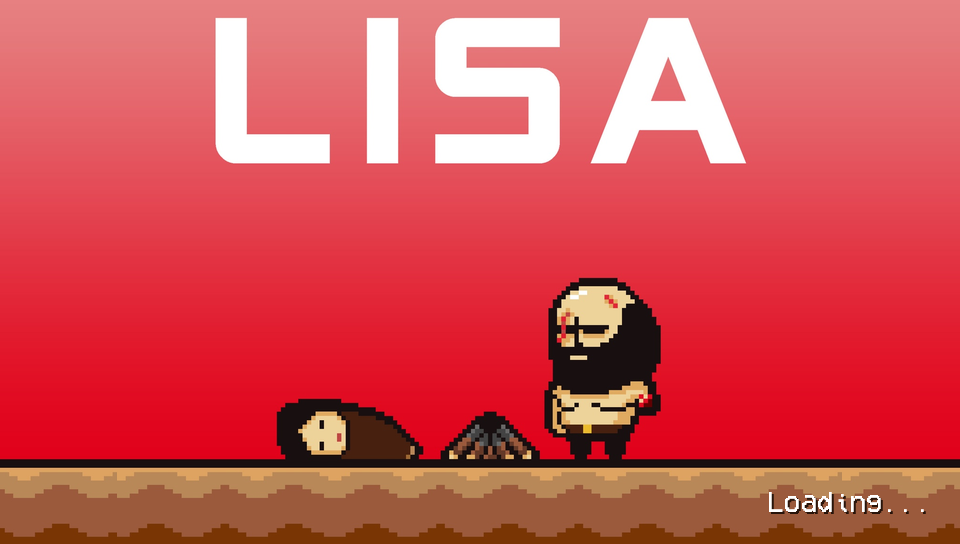

# LISA: The Painful — PS Vita Port

An unofficial native PS Vita port of **LISA: The Painful**, based on
mkxp-z and the RGSS3 runtime.

> Current status: **Alpha 1** — playable from start to finish on real hardware.

## About

This project aims to make LISA: The Painful playable natively on PS Vita.

The port uses mkxp-z as its base, with extensive Vita-specific work for
rendering, audio, memory management, Ruby/RGSS3 compatibility and performance.
The game's own scripts run unchanged.

## Download

Get `LISA-Vita-alpha1.vpk` from the [Releases](../../releases) page and install it
with VitaShell. The game files are not included: see [Installation](#installation).

## Current Status

The game is currently playable on real PS Vita hardware.

Tested functionality includes:

- Main story progression (the game has been completed on hardware)
- Maps and events
- Battles and combo input
- Save/load
- BGM, BGS, ME and SE
- Suspend/resume
- Custom RGSS3 scripts
- Vita controls, including both analog sticks
- Long-session stability testing

Performance is still being optimized, particularly on maps with a large
number of active events.

## Installation

This repository does **not** contain any LISA: The Painful game assets.

You must own a legitimate copy of the game and provide the required game
files yourself:

1. Install the VPK.
2. Extract the game's `Game.rgss3a` archive (if your copy has one), for example with
   [rgss3a-extractor](https://github.com/iatsiuk/rgss3a-extractor).
3. Copy `Data/`, `Graphics/`, `Audio/` and `Fonts/` to `ux0:data/lisa_vita/`.

The first launch pauses for about 10 seconds while the shaders are compiled;
later launches are fast.

See the [Installation Guide](docs/INSTALLATION.md) for the details.

## Controls

| Vita | Game |
|---|---|
| D-pad or left stick | Move / select |
| Cross | Confirm |
| Circle | Cancel / menu |
| L / R | Previous / next page in menus |
| Triangle (or R), Square, Cross, Circle | Combo keys W, A, S, D in battle |
| Right stick up / left / down / right | Combo keys W, A, S, D |

In battle, the combo skill descriptions show the PlayStation buttons instead of
the PC keys.

## Compatibility / Known Issues

This is still an alpha-quality port.

Known limitations and performance issues are documented in
[Known Issues](docs/KNOWN_ISSUES.md).

## Performance

The port targets 60 FPS: exploration and battles run at or near 60 FPS most
of the time, with occasional short stutters.

Performance depends heavily on the number and complexity of RGSS3 events
running on a map. Significant optimization work has already been done to move
performance-critical code from Ruby into native code.

Tested with [PSVshell](https://github.com/Electry/PSVshell) at 500/222/222/166 MHz;
at stock clocks performance is lower.

## Technical Information

The Vita port includes work on:

- mkxp-z / RGSS3 adaptation
- Ruby 3.1 cross-compiled for the Vita, with Fibers on a pthread pool
- Vita rendering backend (vitaGL)
- audio streaming
- custom memory management
- Vita suspend/resume handling
- Vita-specific performance optimizations

More information is available in [Technical Notes](docs/TECHNICAL.md).

## Building

See [Building](docs/BUILDING.md).

## Disclaimer

This is an unofficial, free, non-commercial fan project and is not affiliated
with Dingaling Productions, Serenity Forge or the official developers/publishers
of LISA.

No game files are distributed with this project: you need your own copy of the
game. The LiveArea and loading screen images are fan artwork based on the game.

## Credits

See [CREDITS.md](CREDITS.md).

## License

See [LICENSE](LICENSE).
